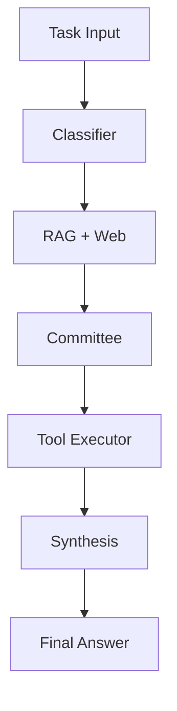

# SumoSpace

A locally-first, multi-agent autonomous task execution framework with zero cloud dependencies.

[](https://badge.fury.io/py/sumospace)
[](https://www.python.org/downloads/)
[](https://opensource.org/licenses/MIT)
[](https://github.com/Omdeepb69/SumoSpace/actions)
[](https://codecov.io/gh/Omdeepb69/SumoSpace)

## The 60-second pitch

SumoSpace is a locally-first autonomous task execution framework designed for deterministic control over complex workflows. It provides a multi-agent deliberation pipeline (Planner → Critic → Resolver) that safely interacts with your local filesystem and tools, with full memory and RAG capabilities. Built with privacy and speed in mind, it operates entirely on your local machine with zero cloud dependencies required.

```bash
pip install sumospace
```

```python
from sumospace import SumoKernel, SumoSettings
import asyncio

async def main():
    async with SumoKernel(SumoSettings(provider="ollama", model="phi3:mini")) as kernel:
        trace = await kernel.run(
            "Find all functions in ./src that have no docstrings and add them"
        )
        print(trace.final_answer)

asyncio.run(main())
```

## Why SumoSpace

| Capability | SumoSpace | LangChain | LlamaIndex | AutoGPT |
|:---|:---:|:---:|:---:|:---:|
| **Local Inference** | First-class | Bolted-on | Bolted-on | Secondary |
| **Multi-user Isolation** | Native (Scope) | Manual | Manual | None |
| **Planning Safety** | Committee | None | None | Prompt-based |
| **Cloud Required** | No | Optional | Optional | No |
| **Tool Execution Safety** | Sandbox/Blocked | Optional | Optional | None |
| **Streaming** | Native | Complex | Native | None |
| **Configuration Depth** | High | Extreme | High | Low |
| **Learning Curve** | Moderate | Steep | Moderate | Low |
| **Community Size** | Small | Massive | Large | Large |

**Use SumoSpace when:** You need autonomous, multi-agent planning and execution that runs entirely locally, interacting deeply with files, tools, and custom environments.
**Don't use SumoSpace when:** You simply need to stitch together an enormous ecosystem of cloud integrations or prefer relying on prompt-engineered chains over defined agent topologies.

## Installation

```bash
# Minimal (Ollama or cloud providers only)
pip install sumospace

# With local HuggingFace inference
pip install sumospace[local]

# With OpenTelemetry observability
pip install sumospace[telemetry]

# With cloud provider SDKs
pip install sumospace[cloud]

# With desktop automation tools
pip install sumospace[desktop]

# Everything
pip install sumospace[all]
```

| Provider | Python | RAM (Min) | GPU |
|:---|:---:|:---:|:---:|
| **Ollama** | 3.10+ | 8GB | Recommended |
| **HuggingFace** | 3.10+ | 16GB | Optional (CUDA/MPS) |
| **vLLM** | 3.10+ | 32GB | Required (NVIDIA) |
| **Cloud** | 3.10+ | 2GB | Not Required |

## Core Concepts



1. **Classifier**: Identifies the intent of your task (coding, conversational, research) to intelligently toggle RAG, Web Search, or Committee deliberation.
2. **RAG + Web**: Retrieves semantically relevant context from your ingested codebase and history, grounding the agents with accurate knowledge before planning.
3. **Committee**: Planner, Critic, and Resolver agents deliberately analyze the request and negotiate a safe, actionable, multi-step execution plan.
4. **Tool Executor**: Runs the approved steps against the host system (executing shell commands, patching files, reading web pages) while enforcing safety checks.
5. **Synthesis**: Combines the original task intent, retrieved context, and tool output into a cohesive and complete final answer.

## Provider Configuration

```python
# Ollama (recommended for local development)
SumoSettings(provider="ollama", model="phi3:mini")
SumoSettings(provider="ollama", model="llama3:8b")
SumoSettings(provider="ollama", model="deepseek-coder:6.7b")

# HuggingFace (in-process, no server needed)
SumoSettings(provider="hf", model="microsoft/Phi-3-mini-4k-instruct")
SumoSettings(provider="hf", model="mistralai/Mistral-7B-Instruct-v0.2", hf_load_in_4bit=True)

# vLLM (production GPU server)
SumoSettings(provider="vllm", vllm_base_url="http://gpu-server:8000", model="deepseek-coder")

# Cloud (opt-in)
SumoSettings(provider="gemini", model="gemini-pro")   # needs GOOGLE_API_KEY
SumoSettings(provider="openai", model="gpt-4o")       # needs OPENAI_API_KEY
SumoSettings(provider="anthropic", model="claude-3-5-sonnet-20241022")  # needs ANTHROPIC_API_KEY
```

```bash
export SUMO_PROVIDER=ollama
export SUMO_MODEL=phi3:mini
sumo run "your task here"
```

## Inference Modes & Presets

| Preset | Description |
|:---|:---|
| `chat` | Direct conversation, no committee, no RAG. (`--preset chat`) |
| `chat-with-context` | Chat with codebase RAG enabled. (`--preset chat-with-context`) |
| `stateless` | Pure stateless single-turn inference, no memory. (`--preset stateless`) |
| `coding` | Full pipeline optimised for code tasks with tools. (`--preset coding`) |
| `research` | Planning + web search, no code execution. (`--preset research`) |
| `review` | Plan and critique only — never executes tools. (`--preset review`) |

```python
SumoSettings.for_coding(provider="ollama", model="phi3:mini")
```

| Mode | Planner | Critic | Resolver | Use when |
|:---|:---:|:---:|:---:|:---|
| `full` | ✓ | ✓ | ✓ | Default, safest |
| `plan_only` | ✓ | ✗ | ✗ | Speed over safety |
| `critique_only` | ✓ | ✓ | ✗ | Balanced |
| `disabled` | ✗ | ✗ | ✗ | Chat, Q&A |

## Tools

SumoSpace provides comprehensive built-in tools for agents to operate natively on your machine.

**Filesystem**
- `read_file`: Read the contents of a file (e.g. `path="./src/main.py"`)
- `write_file`: Write content to a file, creating directories as needed
- `list_directory`: List files in a directory, optionally filtered
- `search_files`: Search for a pattern in files
- `patch_file`: Apply a unified diff patch

**Code & Shell**
- `shell`: Run a shell command with timeout
- `dependencies`: Install, update, or inspect packages

**Docker**
- `docker`: Run Docker CLI commands (build, run, exec, ps, compose)

**Web & Desktop**
- `web_search`: Search the web using DuckDuckGo (no API key required)
- `fetch_url`: Fetch the text content of a web page
- `browser`: Automate browser interactions (requires `sumospace[desktop]`)

Creating a custom tool:

```python
from sumospace.tools import BaseTool, ToolResult
from typing import ClassVar

class PostgresTool(BaseTool):
    name = "postgres_query"
    description = "Execute a read-only SQL query against PostgreSQL."
    tags: ClassVar[list[str]] = ["database", "sql", "read"]
    schema: ClassVar[dict] = {
        "type": "object",
        "properties": {
            "query": {"type": "string", "description": "SQL SELECT statement"},
        },
        "required": ["query"],
    }

    async def run(self, query: str, **_) -> ToolResult:
        # your implementation
        ...
```

Register it via entry points in `pyproject.toml` so SumoSpace loads it automatically:

```toml
[project.entry-points."sumospace.tools"]
postgres = "my_package.tools:PostgresTool"
```

## Memory & RAG

```python
from sumospace import SumoKernel, SumoSettings

async with SumoKernel(SumoSettings()) as kernel:
    # Ingest your codebase once
    await kernel.ingest("./src")
    await kernel.ingest("./docs")

    # Now all runs have codebase context
    trace = await kernel.run("Find all authentication-related functions")
```

```bash
sumo ingest ./src
sumo ingest ./docs --recursive
sumo run "Explain the authentication flow"
```

## Multi-User Deployment

```python
from fastapi import FastAPI
from sumospace import SumoKernel, SumoSettings
from pydantic import BaseModel

app = FastAPI()

class RunRequest(BaseModel):
    task: str
    user_id: str

@app.post("/run")
async def run_task(request: RunRequest):
    # Per-request kernel — proper isolation, no shared state
    settings = SumoSettings.for_coding(
        provider="ollama",
        user_id=request.user_id,
        scope_level="user",
    )
    async with SumoKernel(settings=settings) as kernel:
        trace = await kernel.run(request.task)
    return {
        "answer": trace.final_answer,
        "success": trace.success,
        "steps": len(trace.step_traces),
    }
```

By initializing `SumoSettings` with different `scope_level` and `user_id` values, agents execute within strict isolation boundaries preventing data crossover. Releasing the `async with` block ensures ChromaDB file locks are released securely.

## Lifecycle Hooks

```python
from sumospace.hooks import HookRegistry

hooks = HookRegistry()

@hooks.on("on_plan_approved")
async def require_approval(plan, verdict):
    print(f"\nAgent wants to execute {len(plan.steps)} steps:")
    for step in plan.steps:
        print(f"  {step.step_number}. [{step.tool}] {step.description}")
    if input("\nApprove? [y/N]: ").strip().lower() != "y":
        raise Exception("User rejected plan")

kernel = SumoKernel(settings=settings, hooks=hooks)
```

```python
@hooks.on("on_task_complete")
async def notify_slack(trace):
    status = "✅" if trace.success else "❌"
    await slack_client.chat_postMessage(
        channel="#ai-agent",
        text=f"{status} Task complete in {trace.duration_ms:.0f}ms: {trace.final_answer[:200]}"
    )
```

```python
@hooks.on("on_task_complete")
def track_cost(trace):
    metrics.increment("agent.tasks.total")
    metrics.histogram("agent.tasks.duration_ms", trace.duration_ms)
    metrics.increment(f"agent.tasks.intent.{trace.intent.value}")
```

Available hooks: `on_run_start`, `on_run_complete`, `on_run_error`, `on_intent_classified`, `on_plan_generated`, `on_plan_approved`, `on_plan_rejected`, `on_step_start`, `on_step_complete`, `on_task_complete`.

## Streaming

```python
from sumospace.kernel import StepTrace, ExecutionTrace, SynthesisChunk

async with SumoKernel(settings) as kernel:
    async for event in kernel.stream_run("Refactor auth.py to use async/await"):
        if isinstance(event, StepTrace):
            status = "✓" if event.result.success else "✗"
            print(f"  [{status}] {event.tool}: {event.description}")
        elif isinstance(event, SynthesisChunk):
            print(event.token, end="", flush=True)  # Real-time token output
        elif isinstance(event, ExecutionTrace):
            print(f"\n\nCompleted in {event.duration_ms:.0f}ms")
```

## Observability

```bash
sumo logs list
sumo logs show e9f2a7a4
sumo logs search "refactor"
```

```python
settings = SumoSettings(
    telemetry_enabled=True,
    telemetry_endpoint="http://jaeger:4317",
)
```

## Configuration Reference

| Field | Type | Default | Env Var | Description |
|:---|:---|:---|:---|:---|
| `provider` | `str` | `"hf"` | `SUMO_PROVIDER` | Inference provider (ollama, hf, vllm, etc.) |
| `model` | `str` | `"default"` | `SUMO_MODEL` | Model identifier |
| `embedding_provider` | `str` | `"local"` | `SUMO_EMBEDDING_PROVIDER` | Provider for embeddings |
| `embedding_model` | `str` | `"BAAI/bge-base-en-v1.5"` | `SUMO_EMBEDDING_MODEL` | Embedding model |
| `require_consensus` | `bool` | `True` | `SUMO_REQUIRE_CONSENSUS` | Require committee consensus |
| `committee_enabled` | `bool` | `True` | `SUMO_COMMITTEE_ENABLED` | Enable multi-agent deliberation |
| `committee_mode` | `Literal["full", "plan_only", "critique_only"]` | `"full"` | `SUMO_COMMITTEE_MODE` | Controls which committee agents run |
| `committee_temperature` | `float` | `0.1` | `SUMO_COMMITTEE_TEMPERATURE` | Planner temperature |
| `committee_max_tokens` | `int` | `2048` | `SUMO_COMMITTEE_MAX_TOKENS` | Max tokens for planning |
| `execution_enabled` | `bool` | `True` | `SUMO_EXECUTION_ENABLED` | Allow tools to execute |
| `rag_enabled` | `bool` | `True` | `SUMO_RAG_ENABLED` | Enable vector store retrieval |
| `rag_top_k_final` | `int` | `5` | `SUMO_RAG_TOP_K_FINAL` | Number of chunks to return |
| `memory_enabled` | `bool` | `True` | `SUMO_MEMORY_ENABLED` | Enable episodic memory read and write |
| `shell_sandbox` | `bool` | `True` | `SUMO_SHELL_SANDBOX` | Use sandbox for shell tools |
| `max_retries` | `int` | `3` | `SUMO_MAX_RETRIES` | Max retries for failed tool calls |
| `execution_timeout` | `int` | `120` | `SUMO_EXECUTION_TIMEOUT` | Timeout for tool execution |
| `verbose` | `bool` | `True` | `SUMO_VERBOSE` | Enable detailed logging |
| `dry_run` | `bool` | `False` | `SUMO_DRY_RUN` | Simulate execution |
| `hf_load_in_4bit` | `bool` | `False` | `SUMO_HF_LOAD_IN_4BIT` | Load HF models in 4-bit quantization |
| `secondary_provider` | `Optional[str]` | `None` | `SUMO_SECONDARY_PROVIDER` | Fallback provider |
| `secondary_model` | `Optional[str]` | `None` | `SUMO_SECONDARY_MODEL` | Fallback model |
| `workspace` | `str` | `"."` | `SUMO_WORKSPACE` | Working directory |
| `scope_level` | `str` | `"user"` | `SUMO_SCOPE_LEVEL` | Multi-tenant scope level |
| `user_id` | `str` | `""` | `SUMO_USER_ID` | Identifier for user scope |
| `session_id` | `str` | `""` | `SUMO_SESSION_ID` | Identifier for session scope |
| `project_id` | `str` | `""` | `SUMO_PROJECT_ID` | SUMO_PROJECT_ID |
| `chroma_base` | `str` | `".sumo_db"` | `SUMO_CHROMA_BASE` | Directory for ChromaDB |
| `max_chunks_per_scope` | `Optional[int]` | `None` | `SUMO_MAX_CHUNKS_PER_SCOPE` | RAG limits |
| `prompt_template_path` | `Optional[str]` | `None` | `SUMO_PROMPT_TEMPLATE_PATH` | Directory containing custom prompt .txt files |
| `auto_load_hooks` | `bool` | `False` | `SUMO_AUTO_LOAD_HOOKS` | Automatically load hooks from .sumo_hooks.py |
| `hooks_module` | `Optional[str]` | `None` | `SUMO_HOOKS_MODULE` | Path or dotted module to load hooks from |
| `telemetry_enabled` | `bool` | `False` | `SUMO_TELEMETRY_ENABLED` | Export spans via OpenTelemetry |
| `telemetry_endpoint` | `str` | `"http://localhost:4317"` | `SUMO_TELEMETRY_ENDPOINT` | OTLP endpoint |

## CLI Reference

```bash
sumo run <task>         [--provider] [--model] [--preset] [--no-committee]
                        [--plan-only] [--no-rag] [--dry-run] [--verbose]

sumo ingest <path>      [--recursive] [--force] [--provider]

sumo watch <path> <task> [--debounce] [--ext] [--provider]

sumo logs list          [--last N] [--failed]
sumo logs show <id>
sumo logs search <query>
sumo logs export <id>
sumo logs stats

sumo replay <session-id>
```

## Architecture

- `sumospace/`
  - `kernel.py` — SumoKernel — main orchestrator
  - `settings.py` — SumoSettings — all configuration
  - `committee.py` — PlannerAgent, CriticAgent, ResolverAgent
  - `providers.py` — ProviderRouter, BaseProvider, all providers
  - `tools.py` — BaseTool, ToolRegistry, all built-in tools
  - `classifier.py` — RuleBasedClassifier, LLMClassifier
  - `rag.py` — RAGEngine, retrieval and reranking
  - `memory.py` — MemoryManager, working + episodic memory
  - `ingest.py` — UniversalIngestor, file loaders, chunking
  - `scope.py` — ScopeManager, multi-tenant isolation
  - `audit.py` — AuditLogger, session persistence, stats
  - `telemetry.py` — SumoTelemetry, OpenTelemetry integration
  - `hooks.py` — HookRegistry, lifecycle events
  - `templates.py` — TemplateManager, prompt customization
  - `cli.py` — Typer CLI application
  - `exceptions.py` — SumoSpaceError hierarchy

## Contributing

We welcome contributions! See `CONTRIBUTING.md` for details.
1. Fork the repo.
2. `pip install -e ".[dev]"`
3. Add your tool (subclass `BaseTool`) or provider (subclass `BaseProvider`).
4. `pytest tests/` (requires 75%+ coverage).
5. Submit a PR.

## Roadmap

v0.2 — Ecosystem
  [ ] Plugin entry point marketplace
  [ ] MkDocs hosted API reference
  [ ] LangChain tool adapter (use LC tools in SumoSpace)
  [ ] Jupyter notebook integration

v0.3 — Scale  
  [ ] Distributed task queue (Celery/Redis backend)
  [ ] Multi-modal tool support (image input/output)
  [ ] Agent-to-agent communication (nested kernels)
  [ ] Web UI dashboard for sumo logs

## License

MIT. See [LICENSE](LICENSE) for details.

## Acknowledgements

Built on top of [ChromaDB](https://www.trychroma.com/), [HuggingFace Transformers](https://huggingface.co/), [Ollama](https://ollama.ai/), [vLLM](https://github.com/vllm-project/vllm), [Pydantic](https://docs.pydantic.dev/), [Typer](https://typer.tiangolo.com/), [Rich](https://github.com/Textualize/rich), and [OpenTelemetry](https://opentelemetry.io/).
