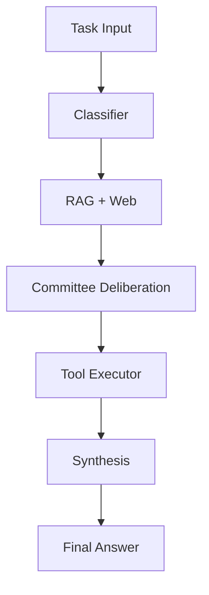

# SumoSpace

A locally-first, multi-agent autonomous task execution framework with zero cloud dependencies.

[](https://badge.fury.io/py/sumospace)
[](https://www.python.org/downloads/)
[](https://opensource.org/licenses/MIT)
[](https://github.com/Omdeepb69/SumoSpace/actions)
[](https://codecov.io/gh/Omdeepb69/SumoSpace)

## The 60-second pitch

SumoSpace is a framework for building and running autonomous AI agents that operate entirely on your local machine. It provides a robust pipeline for task classification, RAG-enhanced context building, multi-agent deliberation, and safe tool execution. Unlike other frameworks, SumoSpace prioritizes privacy, speed, and deterministic control over your local environment.

```bash
pip install sumospace
```

```python
from sumospace import SumoKernel, SumoSettings
import asyncio

async def main():
    async with SumoKernel(SumoSettings(provider="ollama", model="phi3:mini")) as kernel:
        trace = await kernel.run(
            "Find all functions in ./src that have no docstrings and add them"
        )
        print(trace.final_answer)

if __name__ == "__main__":
    asyncio.run(main())
```

## Why SumoSpace

SumoSpace is built for developers who need autonomous agents that stay local.

| Capability | SumoSpace | LangChain | LlamaIndex | AutoGPT |
|:---|:---:|:---:|:---:|:---:|
| **Local Inference** | First-class | Bolted-on | Bolted-on | Secondary |
| **Multi-user Isolation** | Native (Scope) | Manual | Manual | None |
| **Planning Safety** | Committee | None | None | Prompt-based |
| **Cloud Required** | No | Optional | Optional | No |
| **Tool Execution Safety** | Sandbox/Blocked | Optional | Optional | None |
| **Streaming** | Native | Complex | Native | None |
| **Configuration Depth** | High | Extreme | High | Low |
| **Learning Curve** | Moderate | Steep | Moderate | Low |
| **Community Size** | Small | Massive | Large | Large |

**Use SumoSpace when:** You need high-performance, private agents that interact with your local filesystem or internal APIs with a clean, unified interface.
**Don't use SumoSpace when:** You need a massive library of 500+ pre-built integrations or are strictly building cloud-native SaaS applications where local execution isn't a requirement.

## Installation

```bash
# Minimal (Ollama or cloud providers only)
pip install sumospace

# With local HuggingFace inference (Transformers, Torch)
pip install sumospace[local]

# With OpenTelemetry observability
pip install sumospace[telemetry]

# With cloud provider SDKs (Gemini, OpenAI, Anthropic)
pip install sumospace[cloud]

# With desktop automation tools (PyAutoGUI)
pip install sumospace[desktop]

# Everything
pip install sumospace[all]
```

### System Requirements

| Provider | Python | RAM (Min) | GPU |
|:---|:---:|:---:|:---:|
| **Ollama** | 3.10+ | 8GB | Recommended |
| **HuggingFace** | 3.10+ | 16GB | Optional (CUDA/MPS) |
| **vLLM** | 3.10+ | 32GB | Required (NVIDIA) |
| **Cloud** | 3.10+ | 2GB | Not Required |

## Core Concepts

SumoSpace operates as a sequential pipeline where each stage refines the task execution.



1.  **Classifier**: Identifies the intent (e.g., coding, research, chat) and determines if the task needs RAG retrieval, web search, or specific toolsets.
2.  **RAG + Web**: Retrieves relevant context from your ingested codebase or performs live web searches to ground the agent in reality.
3.  **Committee**: A multi-agent deliberation phase (Planner → Critic → Resolver) that generates a safe, multi-step execution plan.
4.  **Tool Executor**: Executes the approved plan steps sequentially (shell commands, file edits, etc.) with safety checks.
5.  **Synthesis**: Combines the original task, the context, and the tool execution results into a clear final answer.

## Provider Configuration

### Local Providers

```python
# Ollama (Recommended)
SumoSettings(provider="ollama", model="phi3:mini")

# HuggingFace (In-process)
SumoSettings(provider="hf", model="microsoft/Phi-3-mini-4k-instruct")
SumoSettings(provider="hf", model="mistralai/Mistral-7B-Instruct-v0.2", hf_load_in_4bit=True)

# vLLM (Production)
SumoSettings(provider="vllm", vllm_base_url="http://localhost:8000", model="deepseek-coder")
```

### Cloud Providers (Opt-in)

```python
# Gemini
SumoSettings(provider="gemini", model="gemini-1.5-flash") # Needs GOOGLE_API_KEY

# OpenAI
SumoSettings(provider="openai", model="gpt-4o") # Needs OPENAI_API_KEY

# Anthropic
SumoSettings(provider="anthropic", model="claude-3-5-sonnet-20241022") # Needs ANTHROPIC_API_KEY
```

### Environment Variables

You can also configure SumoSpace via environment variables:

```bash
export SUMO_PROVIDER=ollama
export SUMO_MODEL=phi3:mini
export SUMO_OLLAMA_BASE_URL=http://localhost:11434
sumo run "Explain the codebase"
```

## Inference Modes & Presets

SumoSpace provides presets to quickly configure the agent for specific use cases.

| Preset | Description | CLI Flag |
|:---|:---|:---|
| `chat` | Direct conversation, no committee, no RAG. | `--preset chat` |
| `chat-with-context` | Chat with codebase RAG enabled. | `--preset chat-with-context` |
| `coding` | Full committee + filesystem tools. | `--preset coding` |
| `research` | Web search enabled + plan-only mode. | `--preset research` |
| `review` | Critique-only mode for analysis. | `--preset review` |
| `stateless` | No memory writes or retrieval. | `--preset stateless` |

### Committee Modes

| Mode | Planner | Critic | Resolver | Use When |
|:---|:---:|:---:|:---:|:---|
| `full` | ✓ | ✓ | ✓ | Default, high-safety tasks. |
| `plan_only` | ✓ | ✗ | ✗ | Speed over safety. |
| `critique_only` | ✓ | ✓ | ✗ | Balanced validation. |
| `disabled` | ✗ | ✗ | ✗ | Direct Q&A or Chat. |

## Tools

SumoSpace comes with a powerful set of built-in tools.

### Filesystem
- `read_file`: Read contents of a file.
- `write_file`: Create or overwrite a file.
- `list_directory`: List files with recursive support.
- `search_files`: Regex search across the workspace.
- `patch_file`: Apply unified diffs.

### Code & Shell
- `shell`: Run bash commands with timeout and safety blocks.
- `dependencies`: Manage pip/npm packages.
- `docker`: Build and run containers.

### Web & Desktop
- `web_search`: Zero-config DuckDuckGo search.
- `fetch_url`: Convert any webpage to markdown.
- `browser`: Full Playwright automation (optional).

### Custom Tools

Creating a custom tool is simple:

```python
from sumospace.tools import BaseTool, ToolResult
from typing import ClassVar

class PostgresTool(BaseTool):
    name = "postgres_query"
    description = "Execute a read-only SQL query against PostgreSQL."
    schema: ClassVar[dict] = {
        "type": "object",
        "properties": {
            "query": {"type": "string", "description": "SQL SELECT statement"},
        },
        "required": ["query"],
    }

    async def run(self, query: str, **_) -> ToolResult:
        # Implementation here
        return ToolResult(tool=self.name, success=True, output="Result data")
```

Register it via entry points in your `pyproject.toml`:
```toml
[project.entry-points."sumospace.tools"]
postgres = "my_package.tools:PostgresTool"
```

## Memory & RAG

SumoSpace can ingest your entire codebase to provide context-aware answers.

```python
async with SumoKernel(SumoSettings()) as kernel:
    # Ingest once
    await kernel.ingest("./src")
    
    # Context-aware run
    trace = await kernel.run("How does the authentication flow work?")
```

**CLI Ingestion:**
```bash
sumo ingest ./src --recursive
sumo run "Where is the kernel initialized?"
```

## Multi-User Deployment

SumoSpace is designed for isolation. Use the `async with` pattern to ensure resource cleanup.

```python
from fastapi import FastAPI
from sumospace import SumoKernel, SumoSettings

app = FastAPI()

@app.post("/run")
async def run_task(task: str, user_id: str):
    settings = SumoSettings.for_coding(user_id=user_id, scope_level="user")
    async with SumoKernel(settings) as kernel:
        trace = await kernel.run(task)
    return {"answer": trace.final_answer}
```

## Lifecycle Hooks

Intercept and modify the agent's behavior at key events.

```python
from sumospace.hooks import HookRegistry
hooks = HookRegistry()

@hooks.on("on_plan_approved")
async def manual_gate(plan, verdict):
    print(f"Agent wants to run: {plan.steps}")
    if input("Approve? [y/N]: ") != "y":
        raise Exception("Aborted by user")

@hooks.on("on_task_complete")
async def log_completion(trace):
    print(f"Task finished in {trace.duration_ms}ms")

kernel = SumoKernel(hooks=hooks)
```

## Streaming

Get real-time feedback from the agent as it thinks and acts.

```python
async for event in kernel.stream_run("Refactor auth.py"):
    if isinstance(event, StepTrace):
        print(f"Action: {event.description}")
    elif isinstance(event, SynthesisChunk):
        print(event.token, end="", flush=True)
```

## Observability

SumoSpace has built-in audit logging and OpenTelemetry support.

```python
settings = SumoSettings(
    telemetry_enabled=True,
    telemetry_endpoint="http://localhost:4317"
)
```

**CLI Audit:**
```bash
sumo logs list --failed
sumo logs show <session-id>
sumo replay <session-id>
```

## Configuration Reference

| Field | Type | Default | Env Var | Description |
|:---|:---|:---|:---|:---|
| `provider` | `str` | `"ollama"` | `SUMO_PROVIDER` | Inference provider (ollama, hf, vllm, etc.) |
| `model` | `str` | `"phi3:mini"` | `SUMO_MODEL` | Model identifier |
| `temperature` | `float` | `0.1` | `SUMO_TEMPERATURE` | Generation temperature |
| `committee_enabled`| `bool` | `True` | `SUMO_COMMITTEE_ENABLED`| Enable multi-agent deliberation |
| `rag_enabled` | `bool` | `True` | `SUMO_RAG_ENABLED` | Enable RAG context retrieval |
| `memory_enabled` | `bool` | `True` | `SUMO_MEMORY_ENABLED` | Enable episodic memory |
| `shell_sandbox` | `bool` | `False` | `SUMO_SHELL_SANDBOX` | Use sandbox for shell tools |
| `audit_log_enabled`| `bool` | `True` | `SUMO_AUDIT_LOG_ENABLED`| Persist session traces to disk |
| `telemetry_enabled`| `bool` | `False` | `SUMO_TELEMETRY_ENABLED`| Export spans via OpenTelemetry |

## CLI Reference

```bash
sumo run <task>         # Run a task
sumo ingest <path>      # Ingest files for RAG
sumo watch <path> <task># Run task on file change
sumo logs list          # View session history
sumo replay <id>        # Replay a session step-by-step
```

## Architecture

- `kernel.py`: Main orchestrator.
- `committee.py`: Multi-agent planning logic.
- `providers.py`: LLM abstraction layer.
- `tools.py`: Tool definitions and discovery.
- `rag.py`: Retrieval and embedding management.
- `audit.py`: Session persistence and stats.
- `hooks.py`: Event-driven extension system.

## Contributing

We welcome contributions! See `CONTRIBUTING.md` for details.
1. Fork the repo.
2. `pip install -e ".[dev]"`
3. Add your tool/provider.
4. `pytest tests/`
5. Submit a PR.

## Roadmap

- **v0.2**: Plugin marketplace, hosted API docs, LangChain tool adapter.
- **v0.3**: Distributed task queue, Multi-modal support, Agent-to-agent kernels.

## License

MIT License. See [LICENSE](LICENSE) for details.

## Acknowledgements

Built on top of [ChromaDB](https://www.trychroma.com/), [Ollama](https://ollama.ai/), [vLLM](https://github.com/vllm-project/vllm), [HuggingFace](https://huggingface.co/), [Pydantic](https://docs.pydantic.dev/), and [Rich](https://github.com/Textualize/rich).
