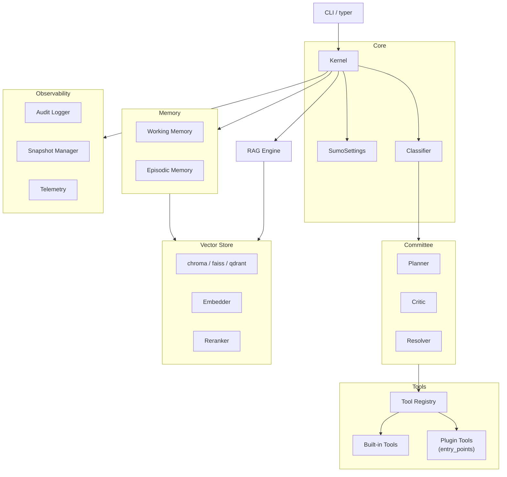
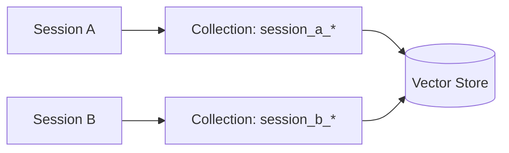

# Architecture

SumoSpace is to LLMs what an operating system is to programs.

The **kernel** schedules tasks. **Tools** are system calls. The **committee** is the permission system — no action is taken without deliberation.

---

## Module Map



---

## The Committee In Depth

The Committee is a **three-agent deliberation pipeline** that sits between the user's task and tool execution. No filesystem write, no shell command, no network call happens unless the Critic approves.

### Planner

The Planner receives:
- The user's task string
- The classified `Intent`
- The list of available tools (names + descriptions only)
- Working memory context (recent tool outputs)

It produces a **structured JSON plan** — an ordered list of steps:

```json
{
  "reasoning": "The user wants docstrings. I need to read the file first, then write updated content.",
  "steps": [
    {"tool": "read_file",  "args": {"path": "./src/utils.py"}},
    {"tool": "write_file", "args": {"path": "./src/utils.py", "content": "..."}}
  ]
}
```

### Critic

The Critic receives the **full plan** and evaluates it against:

- **Scope check** — does the plan touch files outside the working directory?
- **Destructive check** — does any step delete or overwrite without a prior read?
- **Shell blocklist** — does any tool argument contain a blocked pattern (e.g. `rm -rf`, `curl`, `wget`)?
- **Logical consistency** — does the plan make sense for the stated intent?

**Example rejection:**

```json
{
  "approved": false,
  "reason": "Step 2 writes to /etc/passwd — path is outside the project root. Rejected."
}
```

When rejected, the Resolver is invoked.

### Resolver

The Resolver receives:
- The original plan
- The Critic's rejection reason

It produces a **revised plan** that addresses the Critic's concerns. This feeds back to the Critic for a second review. After 3 failed cycles, the task fails safely — no tools are executed.

---

## Safety Model

SumoSpace implements **three independent safety layers**:

```
Layer 1 — Shell Blocklist (instant, regex-based)
Layer 2 — Committee Review (semantic, LLM-based)
Layer 3 — Snapshot + Rollback (recovery after execution)
```

**Layer 1** catches obvious attacks: `rm -rf`, `curl | bash`, `subprocess.call`, etc.

**Layer 2** catches logic-level risks: out-of-scope writes, data destruction, infinite loops.

**Layer 3** catches failures that slip through layers 1 and 2: if a tool produces a bad result, you can undo it with `sumo rollback`.

---

## Data Flow

Here is the exact call sequence from `kernel.run("task")` to `trace.final_answer`:

1. `SumoKernel.run(task)` — entry point
2. `Classifier.classify(task)` → `Intent`
3. `RAGEngine.retrieve(task)` → relevant code context
4. `WorkingMemory.load(session_id)` → recent history
5. `PlannerAgent.plan(task, intent, context)` → `Plan`
6. `CriticAgent.review(plan)` → `Approval` or `Rejection`
7. If rejected → `ResolverAgent.resolve(plan, rejection)` → revised `Plan` → back to step 6
8. If approved → `ToolExecutor.run(plan.steps)` sequentially:
    - For each step: `SnapshotManager.snapshot()` → `tool.execute()` → append to `step_traces`
9. `WorkingMemory.save(session_id, step_traces)`
10. `AuditLogger.log(session_id, trace)`
11. Return `AgentTrace`

---

## Scope Isolation (Multi-Tenancy)

Each `session_id` gets an isolated ChromaDB collection. Queries in session A cannot retrieve documents ingested in session B.



---

## Extension Points

| Extension | Interface | Registration |
|---|---|---|
| **Provider** | `BaseAdapter` | `SumoSettings(provider=...)` |
| **Tool** | `BaseTool` | `ToolRegistry.register()` or `entry_points` |
| **Hook** | Async callable | `SumoSettings(hooks={event: fn})` |
| **Vector Store** | `BaseVectorStore` | `SumoSettings(vector_store=...)` |
| **Embedder** | `BaseEmbedder` | `SumoSettings(embedder=...)` |

See [Tools](tools.md) and [Hooks](hooks.md) for complete implementation guides.
