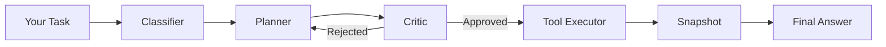

# Quickstart

Get SumoSpace running and executing its first autonomous task in under 5 minutes.

---

## Prerequisites

| Requirement | Version | Notes |
|---|---|---|
| Python | ≥ 3.10 | `python --version` to check |
| pip | ≥ 22 | `pip --version` to check |
| Ollama | Latest | For local models — see Step 2 |

---

## Step 1 — Install

```bash
pip install sumospace
```

Verify the install:

```bash
sumo --version
```

---

## Step 2 — Choose a Provider

=== "Ollama (Recommended)"

    Ollama is the easiest path for local inference — no API key, no internet.

    ```bash
    # 1. Install Ollama (macOS / Linux)
    curl -fsSL https://ollama.com/install.sh | sh

    # 2. Pull a model  (~2.4 GB for phi3:mini, ~4.7 GB for llama3:8b)
    ollama pull phi3:mini   # Fast — great for evaluation
    ollama pull llama3:8b   # Stronger — better plan quality

    # 3. Confirm it's running
    ollama list
    ```

    **Set in your `.env`:**

    ```env
    SUMO_PROVIDER=ollama
    SUMO_MODEL=phi3:mini
    ```

=== "HuggingFace"

    Run inference using HuggingFace Transformers locally.

    ```bash
    pip install sumospace[hf]
    ```

    ```env
    SUMO_PROVIDER=hf
    SUMO_MODEL=microsoft/phi-3-mini-4k-instruct
    # Optional: HF_TOKEN=hf_xxx  (for gated models)
    ```

=== "OpenAI"

    ```bash
    pip install sumospace
    ```

    ```env
    SUMO_PROVIDER=openai
    SUMO_MODEL=gpt-4o-mini
    OPENAI_API_KEY=sk-...
    ```

=== "Anthropic"

    ```bash
    pip install sumospace
    ```

    ```env
    SUMO_PROVIDER=anthropic
    SUMO_MODEL=claude-3-haiku-20240307
    ANTHROPIC_API_KEY=sk-ant-...
    ```

---

## Step 3 — First Run

Create a file called `run.py`:

```python title="run.py"
from sumospace import SumoKernel, SumoSettings
import asyncio

async def main():
    async with SumoKernel(SumoSettings(
        provider="ollama",
        model="phi3:mini",
    )) as kernel:
        trace = await kernel.run(
            "Add docstrings to all functions in ./src/utils.py"
        )
        print(trace.final_answer)

asyncio.run(main())
```

Or use the CLI directly:

```bash
sumo run "Add docstrings to all functions in ./src/utils.py"
```

---

## Step 4 — Understanding the Output

The `trace` object contains everything that happened during execution:

```python
trace.success      # (1) True — all steps completed without error
trace.session_id   # (2) "abc123" — replay with: sumo logs show abc123
trace.intent       # (3) Intent.WRITE_CODE — what the classifier detected
trace.duration_ms  # (4) 14200 — 14 seconds total wall-clock time
trace.step_traces  # (5) list of StepTrace objects, one per tool call
trace.final_answer # (6) "Added docstrings to 8 functions in utils.py"
```

1. **`success`** — `True` only if all plan steps executed, the Critic approved, and no tool raised an unhandled exception.
2. **`session_id`** — a UUID identifying this agent run. Use `sumo logs show <id>` to re-read the full structured log.
3. **`intent`** — the `Intent` enum value the classifier assigned. Controls which tools the Planner is allowed to propose.
4. **`duration_ms`** — total time including model inference, tool execution, and committee deliberation.
5. **`step_traces`** — each `StepTrace` has: `tool`, `args`, `result`, `duration_ms`, `error`.
6. **`final_answer`** — human-readable summary of what was accomplished.

---

## Step 5 — What Just Happened



1. **Classifier** — reads your task and assigns an `Intent` (e.g. `WRITE_CODE`, `READ_FILE`, `REFACTOR`).
2. **Planner** — generates a structured JSON plan: ordered list of tool calls with arguments.
3. **Critic** — reviews the plan. Checks for destructive operations, out-of-scope paths, and logical errors.
4. **Tool Executor** — executes each step sequentially. Captures output after every step.
5. **Snapshot** — before each write, the current file state is saved so rollback is possible.
6. **Final Answer** — a summary of all actions taken.

---

## Next Steps

<div class="feature-grid">
  <div class="feature-card">
    <div class="feature-card-icon">🛡️</div>
    <div class="feature-card-title"><a href="../../concepts/committee/">Committee Deep Dive</a></div>
    <div class="feature-card-desc">Understand exactly what Planner, Critic, and Resolver do and how to tune them.</div>
  </div>
  <div class="feature-card">
    <div class="feature-card-icon">🔌</div>
    <div class="feature-card-title"><a href="../../tools/">Writing Custom Tools</a></div>
    <div class="feature-card-desc">Register your own tools and make the agent aware of them.</div>
  </div>
  <div class="feature-card">
    <div class="feature-card-icon">📊</div>
    <div class="feature-card-title"><a href="../../benchmarks/">Benchmarking</a></div>
    <div class="feature-card-desc">Evaluate model performance on reproducible coding tasks.</div>
  </div>
  <div class="feature-card">
    <div class="feature-card-icon">↩️</div>
    <div class="feature-card-title"><a href="../../rollback/">Rollback & Snapshots</a></div>
    <div class="feature-card-desc">Safely undo any agent action with one command.</div>
  </div>
</div>
