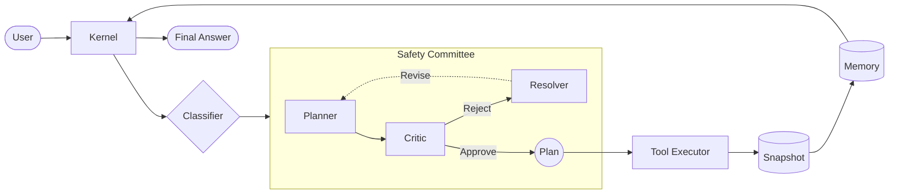

---
hide:
  - navigation
  - toc
---

<div class="hero">
  <div class="hero-badge">v0.2.0 — Now with Media RAG + Rollback</div>
  <h1 class="hero-title">
    Autonomous AI agents.<br>
    <span class="hero-accent">No cloud. No keys. No limits.</span>
  </h1>
  <p class="hero-subtitle">
    SumoSpace is a locally-first agent framework with a three-agent 
    safety committee, built-in rollback, and zero cloud dependencies.
  </p>
  <div class="hero-actions">
    <a href="getting-started/quickstart/" class="hero-btn-primary">
      Get started →
    </a>
    <a href="https://github.com/Omdeepb69/SumoSpace" class="hero-btn-secondary">
      View on GitHub
    </a>
  </div>
</div>

```bash
pip install sumospace
```

<div class="feature-grid">
  <div class="feature-card">
    <div class="feature-card-icon">🛡️</div>
    <div class="feature-card-title">Three-Agent Safety Committee</div>
    <div class="feature-card-desc">Planner, Critic, Resolver deliberate before execution</div>
  </div>
  <div class="feature-card">
    <div class="feature-card-icon">🏠</div>
    <div class="feature-card-title">Truly Local</div>
    <div class="feature-card-desc">HuggingFace, Ollama, vLLM. No cloud required.</div>
  </div>
  <div class="feature-card">
    <div class="feature-card-icon">↩️</div>
    <div class="feature-card-title">Rollback & Snapshots</div>
    <div class="feature-card-desc">One command to undo any agent action</div>
  </div>
  <div class="feature-card">
    <div class="feature-card-icon">🎯</div>
    <div class="feature-card-title">Media RAG</div>
    <div class="feature-card-desc">Ingest images, audio, video alongside code</div>
  </div>
  <div class="feature-card">
    <div class="feature-card-icon">🔌</div>
    <div class="feature-card-title">Plugin Ecosystem</div>
    <div class="feature-card-desc">Register tools via pip install</div>
  </div>
  <div class="feature-card">
    <div class="feature-card-icon">📊</div>
    <div class="feature-card-title">Built-in Benchmarks</div>
    <div class="feature-card-desc">Reproducible evaluation framework</div>
  </div>
</div>



=== "Ollama (Local)"

    ```python
    from sumospace import SumoKernel, SumoSettings
    import asyncio

    async def main():
        async with SumoKernel(SumoSettings(
            provider="ollama",
            model="phi3:mini",
        )) as kernel:
            trace = await kernel.run(
                "Add docstrings to all functions in ./src/utils.py"
            )
            print(trace.final_answer)

    asyncio.run(main())
    ```

=== "CLI"

    ```bash
    pip install sumospace
    ollama pull phi3:mini
    sumo run "Add docstrings to all functions in ./src/utils.py"
    ```

=== "OpenAI"

    ```python
    async with SumoKernel(SumoSettings(
        provider="openai",
        model="gpt-4o",
        # reads OPENAI_API_KEY from env
    )) as kernel:
        trace = await kernel.run("Refactor auth.py to use async/await")
    ```


## Why SumoSpace?

<table class="comparison-table">
  <thead>
    <tr>
      <th>Feature</th>
      <th>SumoSpace</th>
      <th>LangChain / LlamaIndex</th>
    </tr>
  </thead>
  <tbody>
    <tr>
      <td><strong>Core Philosophy</strong></td>
      <td>Execution-first, safe autonomy</td>
      <td>Chain-building, orchestration</td>
    </tr>
    <tr>
      <td><strong>Built-in Safety</strong></td>
      <td><span class="check">✔</span> Three-Agent Committee</td>
      <td><span class="cross">✘</span> Build your own</td>
    </tr>
    <tr>
      <td><strong>Rollback Support</strong></td>
      <td><span class="check">✔</span> Native filesystem snapshots</td>
      <td><span class="cross">✘</span> None</td>
    </tr>
    <tr>
      <td><strong>Cloud Independence</strong></td>
      <td><span class="check">✔</span> 100% offline capable</td>
      <td><span class="extra">~</span> Possible, but cloud-native</td>
    </tr>
    <tr>
      <td><strong>Multi-Modal RAG</strong></td>
      <td><span class="check">✔</span> Native audio/video/image</td>
      <td><span class="check">✔</span> Supported</td>
    </tr>
  </tbody>
</table>

<br>

!!! info "Benchmarks"
    We run reproducible benchmarks using our built-in framework.
    Results for phi3:mini and llama3:8b will be published here
    after community validation. Run your own:
    
    ```bash
    sumo benchmark compare --provider ollama --model llama3:8b
    ```

<div class="footer-cta">
  <h2>Ready to run your first agent?</h2>
  <a href="getting-started/quickstart/" class="hero-btn-primary">
    Read the quickstart →
  </a>
</div>
